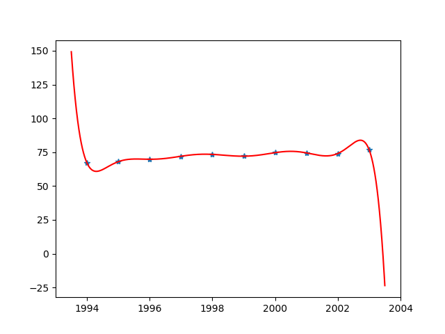

#                     矩阵与数值分析实验作业 #


---


## 1. 9阶多项式拟合问题 ##
- 用九阶多项式拟合曲线，代码如下

  ``` python
  import numpy as np
  import matplotlib.pyplot as plt
  
  x_array = np.arange(1994, 2004, 1)
  y_array = np.array([67.052, 68.008, 69.803, 72.024, 73.400, 72.063, 74.669, 74.487, 74.065, 76.777])
  m = 10
  
  # 定义插值基函数l
  def l(i, x):
      temp0 = 1.0
      temp1 = 1.0
      for k in range(m):
          if k != i:
              temp0 *= (x - x_array[k])
              temp1 *= (x_array[i] - x_array[k])
      return temp0/temp1
  
  # 最终生成的多项式p
  def p(x):
      temp = 0.0
      for i in range(m):
          temp += y_array[i]*l(i, x)
      return temp
  
  
  z1 = np.polyfit(x_array, y_array, 9)
  x = np.linspace(1993.5, 2003.5, 100000)
  y_val = p(x)
  plot1 = plt.plot(x_array, y_array, '*', label='original values')
  plot2 = plt.plot(x, y_val, "r")
  
  # 预估2010年的石油量
  print(p(2010))
  plt.savefig("1-9阶多项式拟合.png")
  ```

- 拟合图像如下：



- 结论
  1. 当2010年时，预估的数据为-1951646.1340000005
  2. 从图像也可以看出，用Lagrange方法，对该10个数据进行插值时，出现了非常严重的Runge现象，因此高次多项式的插值拟合，并不能很好的描绘曲线

## 2. 最小二乘法拟合直线，抛物线，三次曲线问题 ##

- 用最小二乘法拟合离散数据

  ```python
  from scipy.optimize import leastsq
  import matplotlib.pyplot as plt
  import numpy as np
  
  x_array = np.arange(1994, 2004, 1)
  y_array = np.array([67.052, 68.008, 69.803, 72.024, 73.400, 72.063, 74.669, 74.487, 74.065, 76.777])
  
  def aim_func1(p, x):
      """
      一次多项式拟合的方程
      """
      a1, a0 = p
      return a1*x + a0
  
  def aim_func2(p, x):
      """
      二次多项式(曲线)拟合的方程
      """
      a2, a1 , a0 = p
      return a2*(x**2) + a1*x + a0
  
  def error1(p, x, y):
      return aim_func1(p, x)-y
  
  def error2(p, x, y):
      return aim_func2(p, x)-y
  
  p1 = [0, 0]
  p2 = [0, 0, 0]
  Para1 = leastsq(error1, p1, args=(x_array, y_array))
  Para2 = leastsq(error2, p2, args=(x_array, y_array))
  a11, a10 = Para1[0]
  
  def f1(x):
      return a11*x + a10
  mean1 = 0
  mean_square_error1 = 1
  for i in range(len(x_array)):
      mean1 += (f1(x_array[i]) - y_array[i])**2
      mean_square_error2 = mean1**0.5
  print("拟合为直线时的均方差: " + str(mean_square_error1))
  print("估计2010年的值为: " + str(f1(2010)))
  
  a22, a21, a20 = Para2[0]
  
  
  def f2(x):
      return a22*(x**2) + a21*x + a20
  mean2 = 0
  mean_square_error2 = 1
  for i in range(len(x_array)):
      mean2 += (f2(x_array[i]) - y_array[i])**2
      mean_square_error2 = mean2**0.5
  print("拟合曲线为抛物线时的均方差: " + str(mean_square_error2))
  print("估计2010年的值为: " + str(f2(2010)))
  
  
  def three_times_fit():
      # 初始化
      x_array = np.arange(4, 14, 1)
      y_array = np.array([67.052, 68.008, 69.803, 72.024, 73.400, 72.063, 74.669, 74.487, 74.065, 76.777])
      m = len(x_array)
      a = np.zeros((4, 4), dtype='float64')
      b = np.zeros((4, 1))
  
      def f(i, x):
          """
          基函数span{1,x,x^2,x^3}
          """
          if i == 0:
              return 1
          elif i == 1:
              return x
          elif i == 2:
              return x ** 2
          else:
              return x ** 3
  
      def compute_eq():
          """
          计算法方程组的两个相关矩阵
          并求出稀疏矩阵res
          :return:
          """
          for i in range(4):
              for j in range(4):
                  for x in x_array:
                      a[i][j] += f(i, x) * f(j, x)
  
          for i in range(4):
              for j in range(len(y_array)):
                  b[i] += y_array[j] * f(i, x_array[j])
  
          a_inv = np.linalg.inv(a)
          res = np.dot(a_inv, b)
          return res
  
      res = compute_eq()
  
      def fit_y(x_r):
          x = x_r - 1990
          return res[0] + res[1] * x + res[2] * (x ** 2) + res[3] * (x ** 3)
  
      x = np.linspace(1994, 2006, 100000)
      plt.plot(x, fit_y(x), color="black", label="y=ax^3+bx^2+cx+d")
  
      def mean_square_error(x_array, y_array, y):
          mean_error = 0
          for i in range(len(x_array)):
              mean_error += (y_array[i] - y(x_array[i]+1990))**2
              return mean_error**0.5
  
      mean_square_error3 = mean_square_error(x_array, y_array, fit_y)
      print("拟合三次的均方差是: " + str(float(mean_square_error3)))
      fit2010 = fit_y(2010)
      print("估计2010年的值为: " + str(float(fit2010)))
  
  
  plt.figure(figsize=(8, 6))
  three_times_fit()
  plt.scatter(x_array, y_array, color="red", label="Sample Point")
  x = np.linspace(1994, 2006, 100000)
  y2 = a22*(x*x) + a21*x + a20
  plt.plot(x, y2, color="orange", label="y=ax^2+bx+c")
  y1 = a11*x + a10
  plt.plot(x, y1, color="blue", label="ax+b")
  
  plt.legend()
  plt.savefig("2-最小二乘法拟合123次曲线.png")
  ```

- 拟合图像如下：

  
- 运行结果如下：

  | 拟合类型       | 直线              | 抛物线             | 三次曲线           |
  | -------------- | ----------------- | ------------------ | ------------------ |
  | 均方差         | 1                 | 2.6015334175442373 | 0.5064517482791047 |
  | 2010年的预估值 | 83.38227310285265 | 74.42525513470173  | 99.04197715791088  |

- 结论：

  1. 从均方差的角度来看，三次曲线拟合的结果最好

## 3. 牛顿法解方程 ##

- 代码如下

  ```python
  """
  牛顿迭代法求解方程组x^3+x^2+x-3=0 的根，初始值为x0 = -0.7
  迭代7步，并于真值 x*=1 比较
  """
  
  x_true = 1
  
  def f(x):
      """
      y=x^3+x^2+x-3
      :param x:
      :return:y
      """
      return x**3 + x**2 + x - 3
  
  
  def f_derivatives(x):
      """
      :param x:
      :return: y的导数值
      """
      return 3*(x**2) + 2*x + 1
  
  
  def f_derivatives2(x):
      """
      :param x:
      :return: y的二阶导数
      """
      return 6*x + 2
  
  
  def newton_iteration(x):
      """
      牛顿迭代法
      :param x:
      :return:
      """
      return x - f(x) / f_derivatives(x)
  
  
  if __name__ == '__main__':
      xk = -0.7
      ei_s = []
      for i in range(1, 8):
          print(" "*20 + "第 %s 次迭代" % i + " "*20)
          xk = newton_iteration(xk)
          print("xk的值= " + str(xk))
          ei = abs(xk - x_true)
          print("ei = |xi - x*|= " + str(ei))
          ei_s.append(ei)
          if i != 1:
              print("ei / (last_ei)^2 的值= " + str(ei_s[i-1]/(ei_s[i-2])**2))
          print("")
  
      print("f(x∗)的二阶导/2(f(x∗)的导数)= " + str(f_derivatives2(x_true)/(2*f_derivatives(x_true))))
  ```

- 迭代结果如下

  | 迭代次数 | x(i) 的值          | e(i) =xi - x*          | e(i)/(e(i-1))^2    |
  | -------- | ------------------ | ---------------------- | ------------------ |
  | 1        | 2.6205607476635517 | 1.6205607476635517     | -                  |
  | 2        | 1.7084401902625614 | 0.7084401902625614     | 0.2697568987412368 |
  | 3        | 1.2063786980181086 | 0.2063786980181086     | 0.4112050941909951 |
  | 4        | 1.024161664125103  | 0.02416166412510301    | 0.5672795217855637 |
  | 5        | 1.0003814911210203 | 0.00038149112102026095 | 0.6534776653306854 |
  | 6        | 1.0000000969928142 | 9.699281422470563e-08  | 0.6664547866875559 |
  | 7        | 1.0000000000000062 | 0.6608747146171305     | 0.6666666666666666 |

- 结论：
  - 从e(i) / (e(i-1))^2的值可以看出，方程是2阶收敛的。
  - 从f(x∗)的二阶导/2(f(x∗)的导数)= 0.6666666666666666可以看出，e(i)/ (e(i-1))^2是收敛到常数0.666..的,而这个值收敛到常数，也恰好满足迭代法2阶收敛的定义。


## 4. 有方程组 Hx=b, H为n*n阶 Hilbert矩阵，b为n维单位列向量。n=4,8 ##

- 代码如下

  ```python
  import numpy as np
  import copy
  
  
  def gauss(n):
      l = np.zeros((n, n))
      u = np.zeros((n, n))
      a = np.zeros((n, n))
      b = np.ones((n, 1))
  
      # 初始化系数矩阵A
      for i in range(n):
          for j in range(n):
              a[i][j] = 1/(i+1+j+1-1)
  
      # 用Doolittle公式求解l，和u的系数
      for j in range(n):
          u[0][j] = a[0][j]
      for j in range(1, n):
          l[j][0] = a[j][0]/u[0][0]
      for d in range(n):
          l[d][d] = 1
  
      for i in range(1, n):
          for j in range(i, n):
              temp = 0
              for k in range(i):
                  temp += l[i][k] * u[k][j]
              u[i][j] = a[i][j] - temp
  
          for j in range(i+1, n):
              temp = 0
              for k in range(i):
                  temp += l[j][k] * u[k][i]
              l[j][i] = (a[j][i]-temp)/u[i][i]
  
      u_inv = np.linalg.inv(u)
      l_inv = np.linalg.inv(l)
      x = np.dot(u_inv, l_inv)
      x = np.dot(x, b)
      return x
  
  
  def jacobi(n):
      a = np.zeros((n, n))
      b = np.ones((n, 1))
      # 系数矩阵A初始化
      for i in range(n):
          for j in range(n):
              a[i][j] = 1/(i+1+j+1-1)
      # 初始解x0 = (0,0,0...共n个0)
      x1 = np.array([[0.0], [0.0], [0.0], [0.0]])
      for _ in range(200):
          x = copy.copy(x1)
          for i in range(n):
              temp = 0
              for j in range(n):
                  if i != j:
                      temp += a[i][j]*x[j][0]
              x1[i][0] = (b[i][0] - temp)/a[i][i]
      return x1
  
  
  def gauss_seidel(n):
      a = np.zeros((n, n))
      b = np.ones((n, 1))
      # 系数矩阵A初始化
      for i in range(n):
          for j in range(n):
              a[i][j] = 1/(i+1+j+1-1)
      # 初始解x0 = (0,0,0...共n个0)
      x = np.ones((n, 1))
      for _ in range(7000):
          for i in range(n):
              temp = 0
              for j in range(n):
                  temp += a[i][j]*x[j][0]
              x[i][0] = x[i][0] + (b[i][0] - temp)/a[i][i]
      return x
  
  
  def inner_product(a, b):
      temp = 0
      for i in range(len(a)):
          temp += a[i]*b[i]
      return temp
  
  
  def c_g(n):
      a = np.zeros((n, n))
      b = np.ones((n, 1))
      # 系数矩阵A初始化
      for i in range(n):
          for j in range(n):
              a[i][j] = 1 / (i + 1 + j + 1 - 1)
      # 初始解x0 = (0,0,0...共n个0)
      r0 = np.zeros((n, 1))
      x = np.ones((n, 1))
      r = b - np.dot(a, x)
      p = r
      time = 0
      while True:
          if (r == r0).all():
              print("C-G法迭代了 " + str(time) + " 次 ")
              return x
          else:
              ap = np.dot(a, p)
              if inner_product(p, ap) == 0:
                  print("C-G法迭代了 " + str(time) + " 次 ")
                  return x
              else:
                  alpha = inner_product(r, r)/(inner_product(p, ap))
                  x1 = x + alpha*p
                  r1 = r - alpha*ap
                  beat = inner_product(r1, r1)/inner_product(r, r)
                  p1 = r1 + beat*p
          r = copy.copy(r1)
          x = copy.copy(x1)
          p = copy.copy(p1)
          time += 1
  
  
  if __name__ == '__main__':
      print(gauss(4))
      print(gauss(8))
      # jacobi(4)
      # jacobi(8)
      print(gauss_seidel(4))
      print(gauss_seidel(8))
      print(c_g(4))
      print(c_g(8))
  ```

- 结论
  1. 用Gauss法求解线性方程组:
     - n=4时，求出精确解 [-4, 60, -180, 140]
     - n=8时，求出精确解 [-8.00000121e+00, 5.04000060e+02, -7.56000074e+03, 4.62000038e+04, -1.38600010e+05, 2.16216013e+05, -1.68168009e+05, 5.14800026e+04]
  2. 用Jacobi法求解: 
     - 不收敛,python报错栈溢出。尝试解简单方程可以解证明算法本身无误。
  3. 用Gauss-Seidel法求解: 
     - n=4时，迭代7000次左右求出解 [-3.99143925, 59.90802849, -179.78427343, 139.86209779]
     - n=8时，迭代很慢，10万次迭代没有求解完成
  4. 用共轭梯度法求解: 
     - n=4时，共迭代54次，求出精确解[-4, 60, -180, 140]
     - n=8时，共迭代664次，求出精确解 [-8.00000121e+00, 5.04000060e+02, -7.56000074e+03, 4.62000038e+04, -1.38600010e+05, 2.16216013e+05, -1.68168009e+05, 5.14800026e+04]

## 5. 编程计算三次样条S, 满足S(0)=1,S(1)=3,S(2)=3,S(3)=4,S(4)=2,其中边界条件为S''(0)=S''(4)=0 ##

- 代码如下

  ```python
  import numpy as np
  from sympy import *
  
  
  # 初始化矩阵, n为阶数, Am=g即为要求的最终形式, lambda1, miu为中间变量
  n = 4
  x = np.array([0, 1, 2, 3, 4])
  y = np.array([1, 3, 3, 4, 2])
  A = np.zeros((5, 5))
  lambda1 = np.zeros(5)
  miu = np.zeros(5)
  h = np.zeros(5)
  g = np.zeros(5)
  
  # 根据课本180/181 页公式初始化g, A
  for i in range(1, n):
      lambda1[i] = 0.5
      miu[i] = 0.5
  
  for i in range(n):
      h[i] = 1
  
  g[0] = 6
  g[4] = -6
  for i in range(1, n):
      g[i] = 3*(miu[i]*(y[i+1]-y[i])/h[i] + lambda1[i]*(y[i]-y[i-1])/h[i-1])
  
  A[0][0] = 2
  A[0][1] = 1
  A[4][3] = 1
  A[4][4] = 2
  for i in range(1, n):
      A[i][i] = 2
      A[i][i-1] = lambda1[i]
      A[i][i+1] = miu[i]
  
  # 解出m
  A_inv = np.linalg.inv(A)
  m = np.dot(A_inv, g)
  
  # 确定n个区间内的函数
  xx = Symbol('x')
  for i in range(n):
      s = ((h[i]+2*(xx - x[i+1]))/(h[i]**3))*((xx - x[i+1])**2)*y[i] + \
          ((h[i]-2*(xx - x[i+1]))/(h[i]**3))*((xx - x[i])**2)*y[i+1] + \
          (xx - x[i])*((xx-x[i+1])**2)*m[i]/(h[i]**2) + (xx - x[i+1])*((xx-x[i])**2)*m[i+1]/(h[i]**2)
      print(s)
  ```

- 运行结果如下：

  3*x<sup>2</sup>*(-2.0*x + 3.0) + 0.678571428571428*x<sup>2</sup>*(x - 1) + 2.66071428571429*x*(x - 1)<sup>2</sup> + (x - 1)<sup>2</sup> (2.0*x - 1.0)

  3*(-2.0*x + 5.0)*(x - 1)<sup>2</sup> + 0.678571428571428*(x - 2)<sup>2</sup>*(x - 1) + 3*(x - 2)<sup>2</sup>*(2.0*x - 3.0) + 0.625*(x - 2)*(x - 1)<sup>2</sup>

  4*(-2.0*x + 7.0)*(x - 2)<sup>2</sup> + 0.625*(x - 3)<sup>2</sup>*(x - 2) + 3*(x - 3)<sup>2</sup>*(2.0*x - 5.0) - 0.178571428571429*(x - 3)*(x - 2)<sup>2</sup>

  2*(-2.0*x + 9.0)*(x - 3)<sup>2</sup> - 0.178571428571429*(x - 4)<sup>2</sup>*(x - 3) + 4*(x - 4)<sup>2</sup>*(2.0*x - 7.0) - 2.91071428571429*(x - 4)*(x - 3)<sup>2</sup>

- 结论：

  1. 上述四个方程即分别对应[0,1],[1,2],[2,3],[3,4]四个区间的样条插值结果。

## 6. 取不同的初值,并使用弦截法,来计算方程组y=x^3 + 2x^2 + 10*x - 100的根 ##

- 首先，画图判断，根的个数为1，故可以用简单的弦截法来求根，图像代码如下：

  

  ```python
  """
  用不同的初始值,并使用弦截法,来计算方程组y=x^3 + 2x^2 + 10x - 100的根
  """
  
  import matplotlib.pyplot as plt
  import numpy as np
  
  
  plt.figure(figsize=(8, 6))
  x = np.linspace(-2, 4, 1000000)
  y = x**3 + 2*(x**2) + 10*x - 100
  plt.plot(x, y, color="orange", label="y=x^3 + 2x^2 + 10x - 100")
  plt.legend()
  plt.savefig("6-弦截法求方程的实根-画图判别个数.png")
  
  """
  经画图判别上述方程只有一个实根(且实根在3.5附近)，可用简单的弦截法计算。
  """
  
  
  def f(x):
      return x**3 + 2*(x**2) + 10*x - 100
  
  
  def secant_method(x0, x1):
      return x1 - f(x1)/(f(x1) - f(x0))*(x1 - x0)
  
  
  def re_secant_method(x0, x1):
      time = 0
      while True:
          temp = secant_method(x0, x1)
          x0 = x1
          x1 = temp
          time += 1
          if abs(f(x1)) - 0 < 0.00001:
              print("迭代了 " + str(time) + " 次")
              print(x1)
              break
  
  
  if __name__ == '__main__':
      print("当初始值选5, 4时 ")
      re_secant_method(5, 4)
      print("当初始值选100, 99时 ")
      re_secant_method(100, 99)
      print("当初始值选取-100, 50时 ")
      re_secant_method(-100, 50)
      print("当初始值选取100000, 200000时 ")
      re_secant_method(100000, 200000)
  ```


- 结论

  | 初值选取（x0，x1） | 迭代次数 |
  | ------------------ | -------- |
  | (5, 4)             | 5        |
  | (-100, 50)         | 13       |
  | (100, 99)          | 16       |
  | (100000, 2000000)  | 42       |

  1. 当精度为1*10^(-5)时,迭代次数如上表所示。
  2. 可以看出，弦截法求方程根时，初值的选取很重要。


## 7. f(x)=e^(3x)cos(Pi*x),考虑f(x)在(0,2pi)上的积分。区间等分为50,100,200,500,1000 ##

## 分别用复合梯形公式以及复合Simpson积分公式计算积分值，与精确值比较,列表说明误差的收敛性 ##

- 实验代码

  ```python
  import numpy as np
  
  
  def f(x):
      return (np.exp(3*x))*(np.cos(np.pi*x))
  
  
  def composite_trapezoidal(n):
      """
      分成n份的复合梯形公式,区间为(0,2pi)
      :param n:
      :return:
      """
      a = 0
      b = 2*np.pi
      h = (b-a)/n
      temp = 0
      for i in range(1, n):
          temp += f(h*i)
      return ((b-a)/(2*n))*(f(a)+f(b)+2*temp)
  
  
  def composite_simpson(n):
      """
      复合Simpson
      """
      a = 0
      b = np.pi*2
      h = (b-a)/n
      temp1 = 0
      temp2 = 0
      for i in range(1, n):
          temp1 += f(h*i)
      for i in range(0, n):
          temp2 += f((0.5+i)*h)
      return ((b-a)/(6*n))*(f(a)+2*temp1+4*temp2+f(b))
  
  
  if __name__ == '__main__':
      test_n = [50, 100, 200, 500, 1000]
      for i in range(len(test_n)):
          print("取等分区间n= " + str(test_n[i]) + " 时的积分结果")
          print(composite_trapezoidal(test_n[i]))
          print(composite_simpson(test_n[i]))
  ```


- 实验结果

  | 等分区间 | 复合梯形                                         | 复合辛普森         |
  | -------- | ------------------------------------------------ | ------------------ |
  | 50       | 35125341.19493705                                | 35231407.86833493  |
  | 100      | 35204891.19998546                                | 35232416.237822525 |
  | 200      | 35225534.978363276                               | 35232479.16807642  |
  | 500      | 35231369.36592426                                | 35232483.25445204  |
  | 1000     | 35232204.782320105                               | 35232483.355091184 |
  | 精确解   | 35232483.36180031,    误差为0.015568195864034351 |                    |

- 结论

  1. 复合梯形公式和复合Simpson都是收敛到精确解的。
  2. 复合Simpson收敛速度更快，也对应了复合Simpson的收敛阶更高这一理论。

# 8. 分别用2点，3点，5点Gauss型积分公式计算如下定积分

- 代码如下

  ```python
  """
  本例采用Gauss-legendre方法构造Gauss积分
  Gauss求积分的步骤
  1. 求积区间和权函数构造n+1次正交多项式
  2. 解出正交多项式的 n+1个零点作为插值节点
  3. 求解n次代数精度得到的n+1个线性方程
  """
  import math
  
  # 被积函数1
  def fun1(x):
      return x**2/((1-x**2)**0.5)
  
  # 被积函数2
  def fun2(x):
      return math.sin(x)/x
  
  
  def main(fun, a, b):
      fun = fun
      a = a
      b = b
      # 构造对应的legendre多项式的求积节点
      g_l_2 = {0.5773502692: 1}
      g_l_3 = {0.7745966692: 0.555555556, 0: 0.8888888889}
      g_l_5 = {0.9061798459: 0.2369268851, 0.5384693101: 0.4786286705, 0: 0.5688888889}
  
      items = ['g_l_2', 'g_l_3', 'g_l_5']
  
      for i in range(len(items)):
          gauss_sum = 0.0
          functions = [g_l_2, g_l_3, g_l_5]
          for key, value in functions[i].items():
              gauss_sum += fun(((b - a) * key + a + b) / 2) * value
              if key > 0:
                  gauss_sum += fun(((a - b) * key + a + b) / 2) * value
          gauss_sum = gauss_sum * (b - a) / 2
          print(items[i], ":   ", gauss_sum)
  
  
  if __name__ == '__main__':
      print("计算函数1的结果 ")
      main(fun1, -1, 1)
      print("计算函数2的结果 ")
      main(fun2, 0, math.pi*0.5)
  ```


- 运行结果：

  |              | 定积分1            | 定积分2            |
  | ------------ | ------------------ | ------------------ |
  | 2点          | 0.8164965809644047 | 1.3704190473423845 |
  | 3点          | 1.0540925540351531 | 1.3707634378263132 |
  | 5点          | 1.2495037445030532 | 1.370762168226821  |
  | ***精确解*** | 1.570796326794678  | 1.3707621681544881 |

- 结论：

  1. 可以看出两个定积分都是逐步收敛到精确解的。
  2. 不同的积分形式收敛速度也不一样。
  3. 同一个积分点数越多越精确。理论上的节点越多，Gauss型求积公式的代数精度越高符合。

# 9. 用Euler，改进的Euler，Runge-Kutta法，步长分别为0.1, 0.01, 0.001求解方程

- 代码如下：

  ```python
  """
  y'=y(cost)
  y(0)=1
  """
  import math
  import matplotlib.pyplot as plt
  import numpy as np
  
  
  # 定义y的导数
  def y_derivatives(y, t):
      return y*math.cos(t)
  
  
  # euler法求微分方程
  def euler():
      h = [0.1, 0.01, 0.001]
      for h1 in h:
          N = 1/h1
          u = [0 for _ in range(int(N+1))]
          t = [0 for _ in range(int(N+1))]
          u[0] = math.cos(t[0])*1
          for i in range(0, int(N)):
              t[i] = i*h1
              u[i+1] = u[i] + h1*y_derivatives(u[i], t[i])
          plt.scatter(1, u[int(N)], color="red", label="euler")
          print("当步长设置为: " + str(h1) + " Euler法的结果如下")
          print(u[int(N)])
  
  
  # 改进的euler方法求解微分方程
  def euler_plus():
      h = [0.1, 0.01, 0.001]
      for h1 in h:
          N = 1 / h1
          u = [0 for _ in range(int(N + 1))]
          t = [0 for _ in range(int(N + 1))]
          u[0] = 1
  
          for i in range(0, int(N+1)):
              t[i] = i*h1
  
          for i in range(0, int(N)):
              u_temp = u[i] + h1*y_derivatives(u[i], t[i])
              u[i+1] = u[i] + (h1*0.5)*(y_derivatives(u[i], t[i])+y_derivatives(u_temp, t[i+1]))
  
          plt.scatter(1, u[int(N)], color="orange", label="euler_plus")
          print("当步长设置为: " + str(h1) + " 改进的Euler法的结果如下")
          print(u[int(N)])
  
  
  # 四阶runge_kutta法
  def runge_kutta():
      h = [0.1, 0.01, 0.001]
      for h1 in h:
          N = int(1 / h1)
          u = [0 for _ in range(int(N + 1))]
          t = [0 for _ in range(int(N + 1))]
          u[0] = 1
          for i in range(N):
              t[i] = i * h1
              k1 = y_derivatives(u[i], t[i])
              k2 = y_derivatives(u[i]+0.5*h1*k1, t[i]+0.5*h1)
              k3 = y_derivatives(u[i]+0.5*h1*k2, t[i]+0.5*h1)
              k4 = y_derivatives(u[i]+h1*k3, t[i]+h1)
              u[i+1] = u[i]+(h1/6)*(k1+2*k2+2*k3+k4)
  
          print("当步长设置为: " + str(h1) + " runge_kutta法的结果如下")
          print(u[int(N)])
          plt.scatter(1, u[int(N)], color="blue", label="runge_kutta")
  
  
  if __name__ == '__main__':
      plt.figure(figsize=(8, 6))
      euler()
      euler_plus()
      runge_kutta()
  
      print("精确解： ", math.exp(math.sin(1)))
      # 绘图
      x = np.linspace(0, 1, 1000)
      yy = np.exp(np.sin(x))
      plt.plot(x, yy, color="black", label="y=e^sin(t)")
      plt.legend()
      plt.savefig("9-微分方程近似解.png")
  ```

- 手动求出 y(t) 的原函数,和求出的近似值对比，画图如下：

  

- 因为图像过于接近，补充表格说明：

  | 步长         | Euler法            | 改进的Euler法                   | Runge-Kutta法(4阶)             |
  | ------------ | ------------------ | ------------------------------- | ------------------------------ |
  | 0.1          | 2.2882605537942076 | 2.3157635557244522              | 2.3197758575243266             |
  | 0.01         | 2.3166671961754823 | 2.319735792689209               | 2.319776824620262              |
  | 0.001        | 2.3194663522951275 | 2.3197764135860863              | 2.319776824715841              |
  | ***精确解*** | 2.319776824715853  | ------------------------------- | ------------------------------ |

- 结论：
  1. 可以很清楚的看出，Runge-Kutta法误差最小。Euler误差最大。
  2. 同一种方法，步长越短，得到的值越精确，但是最终是收敛的，这也与我们的理论知识对应。
